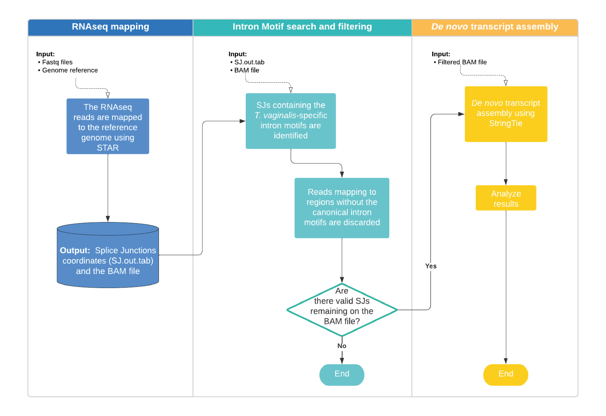
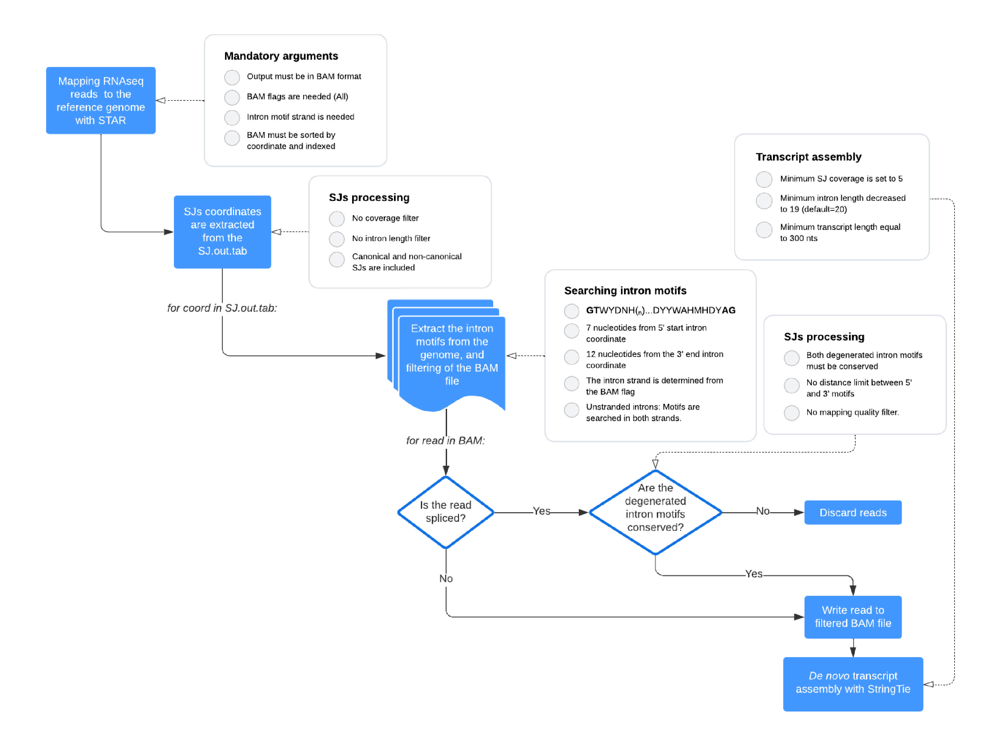

# TACOS :taco:
## Trichomonad Assembler for COmplex Splicing

This semi-automated pipeline was designed to filter the *Trichomonas vaginalis* transcriptome for chimeric alignments. 
The Trichomonas genome, full of complex repeats, can produce hundreds of thousands of chimeric mappings from RNAseq data, making it difficult to produce accurate transcript quantifications and intron detection.

The main part of this pipeline includes a filtering process for those chimeric mappings by leveraging the conserved intron motifs, the genome sequence, and the transcript evidence.

***The introns in these species have conserved intron motifs at 5' and 3' ends beyond the universal GT/AG dinucleotides.***

Although it was designed for Trichomonas vaginalis, the main python script can be used for other species and custom intron motifs, up to seven nucleotides at the 5' and up to twelve at the 3' end. 

## Installation

Before running TACOS, please make sure you meet the following requirements (the use of a conda environment is encouraged):

TACOS has been tested on Python 3.8.12 and the following libraries that might require manual installation:

* [pysam 0.20.0](https://github.com/pysam-developers/pysam)
* [six 1.16.0](https://pypi.org/project/six/)

***We have not tested different versions of pysam / six.***

If the user wants/needs to use the verbose mode, please make sure the plotext library is correctly installed:

* [plotext 2.3.1](https://github.com/piccolomo/plotext)

***We have not tested different versions of plotext.***

Next, the semi-automated pipeline requires the following programs to be installed and available on the path: 

* [STAR 2.7.10a](https://github.com/alexdobin/STAR)
* [StringTie2 v2.2.1](https://github.com/skovaka/stringtie2)
* [Samtools/1.15.1](https://www.htslib.org/)

***Different versions of STAR / StringTie2 / samtools were tested and do not seem to produce different results for the intron identification.***

## The TACOS pipeline is divided into three main steps:

* 1.- RNAseq mapping to the reference genome.
* 2.- Processing of the SJs.
* 3.- Transcript assembly



The complete pseudo-code can be summarized as follows:



## Running TACOS

###### 1. Mapping 

Mapping parameters.
RNAseq mapping was performed using default parameters, except for the BAM flags. The following parameters are mandatory:

```
--outSAMtype BAM SortedByCoordinate 
--outSAMstrandField intronMotif 
--outSAMattributes All
```

###### 2. Indexing

BAM file must be indexed, and the index must be present in the same path.
It can be obtained with samtools by running:

```
$ samtools index file.bam
```

###### 3. Running the main script

```
	This python script is part of the pipeline: Trichomonad Assembler for COmplex Splicing. 

    ---------------------
    
    This version was tested on Python 3.8.12
    
    

Mandatory arguments:
  -f INPUT, --input INPUT
                        Input fasta file (Genome reference)
  -sj SJ_STAR, --input_sj SJ_STAR
                        SJ.out.tab from STAR mapping
  -b BAM_F, --input_bam BAM_F
                        BAM file from STAR mapping

Optional arguments:
  -o OUTPUT, --output OUTPUT
                        Prefix: Prefix for output files, default=filtered
  -5m MOTIF5P, --5p-motif MOTIF5P
                        String: Splicing motif at 5p (upper case nucleotides only, no spaces, up to 7 nucleotides), default:GTWYDNH
  -3m MOTIF3P, --3p-motif MOTIF3P
                        String: Splicing motif at 3p (upper case nucleotides only, no spaces, up to 12 nucleotides), default:TYTAAYHWNCAG
  -v {y,yes,n,no,Y,YES,N,NO,Yes,No}, --verbose {y,yes,n,no,Y,YES,N,NO,Yes,No}
                        Verbose mode, (choices= y, yes, n, no, Y, YES, N, NO, Yes, No), default: yes
  -h, --help            Show this help message and exit

```

###### 4. Transcript assembly 

The transcript assembly can be run using default parameters (using multiple threads if possible and minimum transcript length=300bp) 

## Additional considerations

If you use our script, please consider [citing our work](https://doi.org/10.1101/2024.11.13.623467).

> Redefining the spliceosomal introns of the sexually transmitted parasite *Trichomonas vaginalis* and its close relatives in columbid birds
F. Callejas-Hernández, M Shiratori, SA Sullivan, F. Blow, J. M Carlton - bioRxiv, 2024

:rhinoceros:


